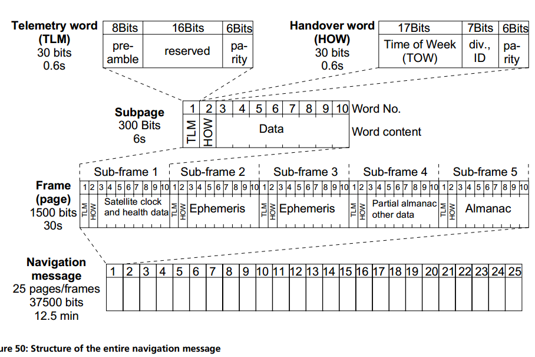

# Location related concepts and terminology
## 定位系统简写
**GNSS** - Global Navigation Satellite System 全球导航卫星系统  
其概念涵盖所有地球定位系统,包括GPS,Glonass,Galieo,BDS等  
**GPS** - Global Positioning System 全球定位系统
美国开发的全球定位系统  
**Glonass** - 全球卫星导航系统 GLOBAL NAVIGATION SATELLITE SYSTEM(俄语缩写)  
苏联开发的全球定位系统  
**Galileo** - Galileo satellite navigation system 伽利略卫星定位系统  
由欧盟研制和建立的全球卫星导航定位系统  
**BDS** - BeiDou Navigation Satellite System 北斗卫星导航系统  
中国自行研制的全球卫星导航系统  
**SBAS** - Satellite Based Augmentation Systems(DGNSS/DGPS/WAAS/EGNOS)  
是利用地球静止轨道卫星建立的地区性广域差分增强系统  
**QZSS** - Quasi-Zenith Satellite System 准天顶卫星系统  
日本开发的以三颗人造卫星透过时间转移完成全球定位系统区域性功能的卫星扩增系统  
**IRNSS** - Indian Regional Navigation Satellite System 印度区域导航卫星系统  
**GANSS** - Galileo and Additional Navigation Satellite Systems  伽利略和附加导航卫星系统  
**AGNSS** - Assisted GNSS 辅助全球定位  
**AGPS** - Assisted Global Positioning System 辅助GPS  
*其他定位系统前加A的意思都类似,指除了从卫星获取信息进行位置计算外,还会从网络侧获取更多的辅助信息加速位置计算*

## 辅助和网络定位相关
**SUPL** - OMA Secure User Plane Location    
**LPP** - LTE Positioning Protocol  
**OTDOA** - Observed Time Difference of Arrival(到达时间差定位法)  
**ECID** - Ehance Community ID 增强型小区定位  
**MBS** - Metropolitan Beacon System 城市移动信标系统
## GNSS各定位系统频段
GPS（US）

|频段|频率（MHz）|
|:--:|:--|
|L1-C/A,L1C|1575.42|
|L2|1227.60|
|L5|1176.45|

Glonass（苏联）

|频段|频率（MHz）|
|:--:|:--|
|L1(FDMA)|1602 + n*0.5625|
|L2(FDMA)|1246 + n*0.4375|
|L3(CDMA)|1202.025|

Galieo（欧洲）

|频段|频率（MHz）|
|:--:|:--|
|E1|1575.42|
|E5|1191.795|
|E5a|1176.45|
|E5b|1207.14|
|E6|1278.75|

北斗

|频段|频率（MHz）|
|:--:|:--|
|B1-2|1589.742|
|B1I|1561.098|
|B3|1268.52|
|B2I|1207.14|

QZSS（Japan）

|频段|频率（MHz）|
|:--:|:--|
|L1-C/A,L1C,L1-SAIF|1575.42|
|L2C|1227.60|
|L5|1176.45|
|LEX|1278.75|

IRNSS（Indian）

|频段|频率（MHz）|
|:--:|:--|
|L5|1176.45|
|S|2492.028|

## 常用概念  
Longitude   经度  
Latitude    纬度  
Altitude   海拔高度  
Geoid   大地水准面  
Ellipsoid and datum     椭圆和基准  
WGS-84  美国的地图参考系统（椭球坐标与地球坐标转换)  
various datum parameters  各种基准参数  

Four satellites are needed to determine longitude, latitude, altitude and time.  
需要四颗卫星来确定经度，纬度，高度和时间  
Each one of these satellites is equipped with onboard atomic clocks.
这些卫星中的每一颗都配备有机载原子钟  
In order to make them even more accurate, they are regularly adjusted or synchronized from various control points on Earth.  
为了使他们更加精确，他们会经常（定期）从地球上的各个控制点调整和同步。  

### 轨道类型
通常，六种不同类别的轨道被分类：  
地球同步轨道（GEO）：地球静止轨道，海拔约36,000km  
中地球轨道（MEO）：中等海拔约10,000公里的倾斜轨道  
低地球轨道（LEO）：低空轨道高达约1000公里  
高度（倾斜）椭圆地球轨道（HEO）  
倾斜地球同步轨道（IGSO）  
极地地球轨道（PEO）：LEO轨道在极地上空  

### 时间系统
时间在基于卫星的定位中起着至关重要的作用，GPS区分5中不同的重要时间系统  
International Atomic Time (TAI)  国际原子时-准确度为每日数纳秒   
Coordinated Universal Time (UTC)  协调世界时/世界统一时间/世界标准时间-准确度为每日数毫秒  
GPS Time  GPS时-一般GPS时间系统表示为周数和该周的经过秒数  
Satellite Time  卫星时间  
Local Time  当地时间  

### GPS Message
The GPS message30 is a continuous stream of data transmitted at 50 bits per second. Each satellite relays the following information to Earth:  
System time and clock correction values  - 系统时间和时钟校正值  
Its own highly accurate orbital data (**ephemeris**) - **星历**  
Approximate orbital data for all other satellites (**almanac**) - **历书**  
System health, etc.  
#### GPS回传详细信息  
  
